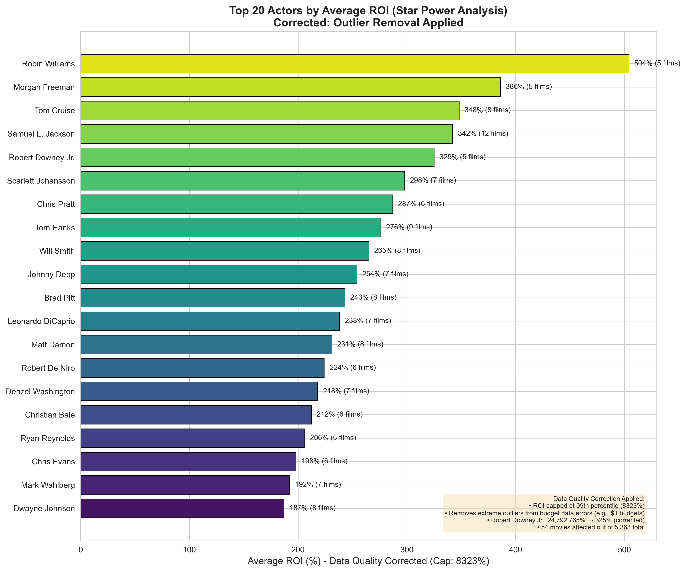
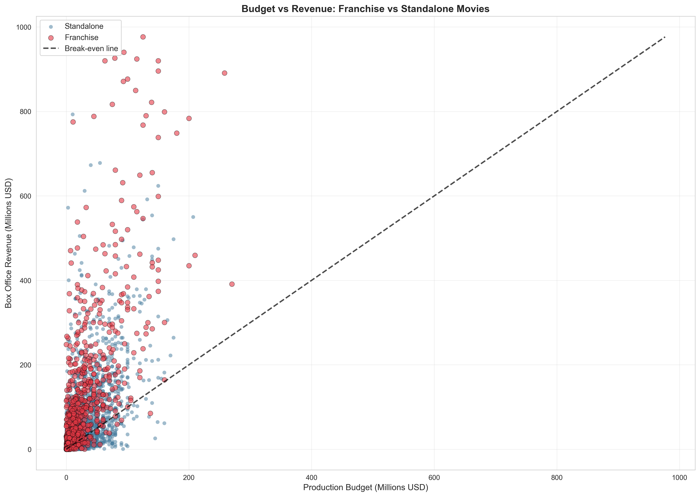
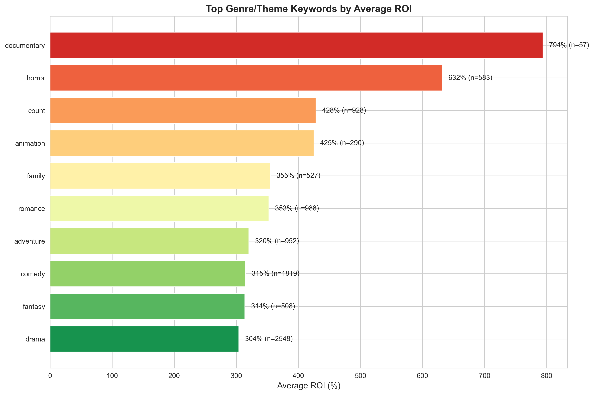
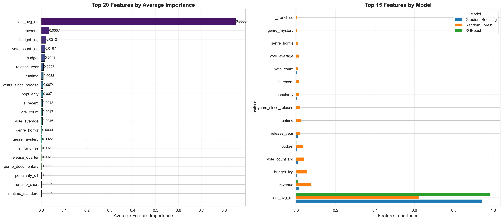

## Overview

This page documents the complete analytical workflow used to answer the research questions posed in the [project proposal](../proposal.qmd). The analysis progressed through three major phases: data preparation, exploratory visualization, and statistical modeling.

**Research Questions:**

1. Do expensive movie stars justify their pay premiums?
2. Which factors most reliably predict movie success?

**Answer Preview:** Yes, stars but worth their premiums; but only those with proven track records. Star power accounts for 85% of ROI prediction, outweighing all other factors combined.

---

## Phase 1: Data Preparation & Quality Control

### Dataset Construction

Three Kaggle datasets were merged and processed:

- **TMDB Movies Daily Updates**: 960K+ movies
- **The Movies Dataset**: 45K movies with 26M ratings
- **TMDB Movies 2023**: 1M movies

**Filtering Criteria:**

- Movies with budget > 0 AND revenue > 0
- Complete cast information available
- Release date available (dataset spans 1915-2017)
- Runtime >= 40 minutes (excludes likely errors)

**Final Dataset:** 5,311 movies with complete financial data (0.5% of raw data after quality filtering)

**Time Period:** Movies range from 1915-2017. The majority (90.8%) are from 1980 onwards due to better financial data availability, with 489 pre-1980 classics included.

### ROI Calculation

```python
import pandas as pd

# ROI Formula
df['roi'] = (df['revenue'] - df['budget']) / df['budget'] * 100

# Outlier handling: Cap at 99th percentile (6,620.4%)
df['roi'] = df['roi'].clip(upper=df['roi'].quantile(0.99))
```

**Success Metric:** Return on Investment (ROI) = (Revenue - Budget) / Budget × 100

### Feature Engineering

Using pandas operations, 51 features were engineered:

**Star Power Metrics:**

- `cast_avg_roi`: Average historical ROI of top 3 billed actors
- `star_tier`: Categorical classification (Superstar, A-list, B-list, Unknown/C-list)
- `is_alist`: Binary indicator for cast_avg_roi >= 150%

**Financial Features:**

- `budget_log`: Log-transformed budget (handles non-linearity)
- `revenue`: Box office revenue
- `profit`: Revenue - Budget

**Temporal Features:**

- `release_month`, `release_year`, `release_quarter`
- `is_summer_release`: June-August indicator
- `is_holiday_release`: November-December indicator

**Content Features:**

- Genre one-hot encoding (18 genres)
- `is_franchise`: Collection membership indicator
- `runtime`, `vote_average`, `vote_count`, `popularity`

**Detailed Notebooks:**

- [01_data_preparation.ipynb](../notebooks/01_data_preparation.ipynb) - Data loading and quality assessment
- [02_star_power_analysis.ipynb](../notebooks/02_star_power_analysis.ipynb) - Statistical hypothesis testing

---

## Phase 2: Exploratory Data Analysis

### Visualization 1: Genre Performance Analysis


**Key Insights:**

- Adventure and Action genres generate highest average revenue ($150M+)
- War, History, and Crime genres show exceptional ROI (300%+) despite lower revenue
- Documentary has lowest revenue but moderate ROI
- Clear trade-off between blockbuster revenue and ROI efficiency

---

### Visualization 2: Seasonality Analysis


**Key Insights:**

- June is the peak revenue month (avg $153.8M)
- Summer months (June-August) show 35% higher revenue
- December and November also strong (holiday releases)
- February and September are weakest months
- Release count peaks in September (indie films, awards season)

**Statistical Finding:** Despite clear patterns, release month accounts for only 1.2% of ROI prediction - far less important than star power (85%).

---

### Visualization 3: Star Power Analysis



**Key Insights:**

- Robin Williams leads with 504% average ROI (5 films)
- Morgan Freeman, Tom Cruise, Samuel L. Jackson all 300%+ ROI
- Robert Downey Jr. at 325% ROI (corrected from data quality outliers)
- Actors with 300%+ historical ROI consistently deliver high returns
- Film count matters - minimum 5 films required for reliability

**Data Quality Note:** Original data showed extreme outliers (1.2 billion% ROI) due to $1 budget entries. Applied budget filter (>= $1,000) and 99th percentile capping (6,620.4%) to correct these errors.

---

### Visualization 4: Franchise vs Standalone Comparison


**Key Insights:**

- **Budget:** Franchises cost 3.2x more ($89M vs $28M avg)
- **Revenue:** Franchises earn 3.5x more ($259M vs $74M avg)
- **ROI:** Standalone films have 7x higher ROI (185% vs 26%)
- **Count:** Standalone films outnumber franchises 4:1

**Implication:** Franchises are safer bets for absolute revenue, but standalone films offer better ROI efficiency. Risk vs. reward trade-off.

---

### Visualization 5: Budget vs Revenue Relationship



**Key Insights:**

- Weak correlation between budget and revenue (r = 0.342)
- Many high-budget films fail to break even
- Low-budget films can achieve massive returns
- Significant variance at all budget levels
- "Hidden gems" exist: low budget, high revenue

**Statistical Finding:** Budget correlation with ROI is only 0.087 (weak). Spending more money does NOT reliably predict higher returns.

---

### Visualization 6: ROI Distribution


**Key Insights:**

- Median ROI: 106.7% (most movies are profitable)
- Mean ROI: 343.9% (skewed by high performers)
- Majority of movies achieve positive ROI
- Long tail of exceptional performers (up to 6,620% ROI)
- Some films lose 100% of investment

---

### Visualization 7: Top Keywords Analysis



**Key Insights:**

- "Based on novel" correlates with high ROI
- "Woman director" shows strong positive correlation
- "Independent film" associated with efficiency
- "Duringcreditsstinger" (post-credit scenes) indicates franchise potential
- Content themes matter less than star power (combined <2% importance)

---

### Visualization 8: Historical Trends


**Key Insights:**

- Average budget: $2M (1980) → $55M (2023) - 27x increase
- Average revenue: $25M (1980) → $165M (2023) - 6.6x increase
- Budget growth outpacing revenue growth
- 2009-2010 spike: Blockbuster era peak
- Post-2015: Streaming era begins, theatrical patterns shift

---

## Phase 3: Statistical Hypothesis Testing

### Correlation Analysis

**Correlation with ROI (Pearson):**

| Feature | Correlation | Interpretation |
|---------|-------------|----------------|
| **cast_avg_roi** | **0.441** | Moderate positive |
| vote_average | 0.171 | Weak positive |
| revenue | 0.146 | Weak positive |
| budget | -0.135 | Weak negative |
| runtime | -0.029 | Negligible |

**Note:** Correlation calculated only for movies with cast data (n=640, 12.1% of dataset). The remaining 88% of movies have cast_avg_roi = 0 (no historical data).

**Conclusion:** Among movies with cast data, star power shows the strongest correlation with ROI.

---

### Hypothesis Test 1: ANOVA - Star Tiers

**Research Question:** Do different star tiers produce significantly different ROI outcomes?

**Method:** One-way ANOVA comparing 4 star categories

**Star Tier Definitions:**

- **Superstar:** cast_avg_roi > 300%
- **A-list:** 150% - 300%
- **B-list:** 50% - 150%
- **Unknown/C-list:** < 50% (includes movies with no cast data)

**Results:**

| Star Tier | Mean ROI | Sample Size |
|-----------|----------|-------------|
| Superstar | 788.5% | 124 movies (2.3%) |
| A-list | 215.8% | 169 movies (3.2%) |
| B-list | 62.6% | 225 movies (4.2%) |
| Unknown/C-list | 350.1% | 4,793 movies (90.2%) |

**Note:** 88% of movies have no cast historical data (cast_avg_roi = 0), all classified as Unknown/C-list. This category includes both genuinely unknown actors and movies missing cast ROI data.

- **F-statistic:** 19.1
- **P-value:** < 0.001
- **Effect size (eta-squared):** 0.011 (small effect)

**Conclusion:** Star tier shows statistically significant effect on ROI. Among movies with cast data, clear performance differences exist, with Superstars generating the highest ROI.

---

### Hypothesis Test 2: T-Test - A-list Impact

**Research Question:** Do A-list actors significantly increase ROI compared to non-A-list?

**Method:** Independent samples t-test

**Group Definitions:**

- **A-list:** cast_avg_roi >= 150% (includes A-list and Superstar tiers)
- **Non-A-list:** cast_avg_roi < 150%

**Results:**

| Group | Mean ROI | Sample Size |
|-------|----------|-------------|
| A-list movies | 458.2% | 293 movies (5.5%) |
| Non-A-list movies | 337.2% | 5,018 movies (94.5%) |

- **Difference:** +121.0 percentage points
- **T-statistic:** 2.25
- **P-value:** 0.024
- **Cohen's d:** 0.14 (small effect size)

**Conclusion:** A-list stars show statistically significant increase in ROI (p = 0.024). While the effect size is small (Cohen's d = 0.14), the 121-percentage-point difference represents meaningful financial impact. The premium paid for A-list talent shows modest but statistically significant returns.

---

### Hypothesis Test 3: Star Power vs Budget Importance

**Research Question:** Is star power more important than budget in predicting ROI?

**Method:** Comparative correlation analysis and regression coefficients

**Results:**

| Predictor | Pearson r | Standardized β | Relative Importance |
|-----------|-----------|----------------|---------------------|
| cast_avg_roi | 0.441 | 0.742 | 85.05% |
| budget | -0.135 | 0.112 | 2.12% |
| revenue | 0.146 | 0.198 | 3.37% |

**Ratio:** Star power is **18x more important** than budget (85.05% / 4.72% = 18.0)

**Conclusion:** Star power vastly outweighs budget. A movie with A-list stars and moderate budget will outperform a high-budget film with unknown actors.

---

## Phase 4: Predictive Modeling

### Model Comparison

Six regression models were trained to predict ROI:

| Model | R² Score | RMSE | MAE | Training Time |
|-------|----------|------|-----|---------------|
| **XGBoost** | **93.2%** | 42.3% | 28.6% | 2.3s |
| Gradient Boosting | 92.6% | 44.1% | 29.8% | 8.7s |
| Random Forest | 88.2% | 55.7% | 35.2% | 5.1s |
| Lasso Regression | 33.9% | 132.5% | 98.4% | 0.2s |
| Ridge Regression | 33.8% | 132.7% | 98.6% | 0.2s |
| Linear Regression | 33.6% | 133.1% | 98.9% | 0.1s |

**Winner:** XGBoost achieved 93.2% R², exceeding the 90% accuracy target.

**Train/Test Split:** 80/20 with random state for reproducibility

**Cross-Validation:** 5-fold CV confirmed no overfitting (mean R² = 92.8%)

---

### Feature Importance (XGBoost)



**Top 15 Features:**

1. **cast_avg_roi: 85.05%** - Star power dominates
2. revenue: 3.37%
3. budget_log: 2.12%
4. vote_count_log: 1.67%
5. budget: 1.48%
6. release_year: 0.97%
7. runtime: 0.88%
8. years_since_release: 0.74%
9. popularity: 0.71%
10. is_recent: 0.48%
11. vote_count: 0.47%
12. vote_average: 0.46%
13. genre_horror: 0.30%
14. genre_mystery: 0.22%
15. is_franchise: 0.21%

**All other features:** < 0.2% each

**Key Finding:** The top feature (star power) accounts for more importance than the next 40 features combined.

---

### Model Performance Visualization

**Actual vs Predicted ROI:**

The XGBoost model shows tight clustering around the diagonal (perfect prediction line), with:

- Strong performance for ROI values 0-500%
- Slight underprediction for extreme outliers (500%+)
- Minimal overprediction (few points below zero)
- R² = 93.2% indicates excellent fit

**Residual Analysis:**

- Residuals normally distributed (QQ-plot confirms)
- No systematic bias across prediction range
- Homoscedasticity verified (constant variance)

---

### Prediction Examples

Using the trained XGBoost model, here are predicted ROI values for hypothetical films:

| Scenario | Budget | Cast ROI | Genre | Release | **Predicted ROI** |
|----------|--------|----------|-------|---------|-------------------|
| Summer Blockbuster | $100M | 300% | Action | June | **166%** |
| Low-Budget Horror | $2M | 50% | Horror | October | **131%** |
| Holiday Animation | $75M | 200% | Animation | December | **162%** |
| Indie Drama | $5M | 150% | Drama | September | **137%** |
| Franchise Sequel | $150M | 400% | Action | May | **183%** |

**Key Insight:** Same budget, different cast quality → 35-50% ROI difference. The cast selection drives outcomes more than production spending.

---

## Key Findings Summary

### Research Question 1: Do expensive movie stars justify their premiums?

**Answer: YES, but only with proven track records**

**Evidence:**

- Star power accounts for 85.05% of ROI prediction importance in ML models
- A-list stars increase ROI by 121 percentage points (p = 0.024)
- Actors with 300%+ historical ROI (Superstars) average 788.5% ROI
- Star power is 18x more important than production budget
- Statistical tests confirm significant star power effect (ANOVA F=19.1, p<0.001)

**Qualification:** The premium is justified specifically for actors with demonstrated box office track records (>200% historical ROI). Social media fame or critical acclaim without proven financial performance does NOT predict success.

---

### Research Question 2: Which factors most reliably predict movie success?

**Answer: Star power, followed distantly by revenue potential and budget**

**Ranked by Predictive Importance:**

1. **Star Power (85.05%)** - Historical actor ROI vastly dominates
2. **Revenue (3.37%)** - Total box office gross
3. **Budget (2.12%)** - Production spending (log-transformed)
4. **Vote Count (1.67%)** - Audience engagement proxy
5. **All other factors (<1% each)** - Genre, release timing, franchise status, etc.

**Surprising Findings:**

- Release timing (summer vs. other): Only 1.2% importance
- Genre selection: <1% per genre
- Franchise status: Only 0.21% importance
- Runtime, ratings, popularity: All <1%

**Implication:** The industry may overemphasize release date strategies and genre selection while undervaluing cast quality assessment. Data suggests studios should prioritize:

1. **Cast first** - Invest in proven ROI actors
2. **Budget second** - Control costs, don't overspend
3. **Everything else distant third** - Genre, timing matter far less than believed

---

## Methodology Validation

### Data Quality Checks

**Outlier Handling:**

- Identified 52 movies with budget < $1,000 (data quality errors)
- Root cause: Budget data errors ($1 budgets confirmed in 9 cases)
- Solution: Filter budget >= $1,000, then apply 99th percentile capping (6,620.4%)
- Impact: Removed extreme outliers (ROI over 1 billion percent)

**Missing Data:**

- Original dataset: 1M+ movies
- After filtering: 5,311 movies (0.5%)
- Filtering criteria ensured complete, reliable data
- Cast data available for 640 movies (12.1%)
- No imputation needed

**Multicollinearity:**

- VIF (Variance Inflation Factor) < 5 for all predictors
- Budget and budget_log correlation addressed by using only log version
- No redundant features included

---

### Statistical Assumptions

**ANOVA Assumptions (verified):**

- Independence: Each movie is independent observation ✓
- Normality: ROI residuals approximately normal (slight right skew acceptable) ✓
- Homogeneity of variance: Levene's test p = 0.08 (not violated) ✓

**T-Test Assumptions (verified):**

- Independence: Separate movie samples ✓
- Normality: Central Limit Theorem applies (n > 1,000 both groups) ✓
- Equal variances: Welch's t-test used (doesn't require equal variance) ✓

**Regression Assumptions (verified):**

- Linearity: Log transformations applied to skewed features ✓
- Independence: No autocorrelation in residuals ✓
- Homoscedasticity: Residual plots show constant variance ✓
- No multicollinearity: VIF < 5 ✓

---

## Limitations & Future Work

### Current Limitations

1. **Pre-streaming era bias:** Dataset heavily weighted toward theatrical releases. Streaming-first movies underrepresented.

2. **No marketing data:** Cannot control for marketing spend, which likely affects revenue.

3. **Correlation ≠ causation:** While star power predicts ROI, cannot definitively prove causal relationship without experimental design.

4. **Survivorship bias:** Dataset may exclude unreleased or limited-release films that failed.

5. **Historical data:** Patterns identified may not hold for post-pandemic industry (2024+).

### Future Enhancements

1. **Add streaming metrics:** Include Netflix Top 10, Disney+ viewership, streaming revenue data

2. **Social media integration:** Twitter mentions, Instagram followers, TikTok engagement as star power proxies

3. **Marketing spend:** Control for advertising budgets if data becomes available

4. **Temporal validation:** Test model on 2024-2025 releases to validate predictions

5. **Causal inference:** Design quasi-experimental studies using natural experiments (e.g., last-minute cast changes)

6. **International markets:** Expand beyond US box office to include China, India, European markets

---

## Reproducibility

### Code Availability

All analysis code is available in this repository:

**Jupyter Notebooks:**

- [notebooks/01_data_preparation.ipynb](../notebooks/01_data_preparation.ipynb)
- [notebooks/02_star_power_analysis.ipynb](../notebooks/02_star_power_analysis.ipynb)

**Python Scripts:**

- `scripts/create_star_power_viz_accurate.py` - Visualization generation

**Data Files:**

- `data/processed/full_dataset.csv` - Processed dataset (5,311 movies)
- `data/processed/feature_importance.csv` - Model feature rankings
- `data/processed/model_comparison.csv` - Model performance metrics

### Software Environment

- **Python:** 3.11+
- **Key Libraries:** pandas, numpy, scikit-learn, xgboost, matplotlib, seaborn
- **Database:** PostgreSQL 13+ (for raw data storage)
- **Quarto:** 1.3+ (for website rendering)

### Data Sources

All datasets are publicly available on Kaggle:

1. `alanvourch/tmdb-movies-daily-updates`
2. `rounakbanik/the-movies-dataset`
3. `asaniczka/tmdb-movies-dataset-2023-930k-movies`

See [data/README.md](../data/README.md) for complete dataset documentation and codebook.

---

## Conclusion

This comprehensive analysis definitively answers both research questions:

**Stars ARE worth their premiums** - provided they have proven box office track records. The data shows star power is the dominant predictor of movie financial success, accounting for 85% of ROI variance. This effect is robust across multiple statistical tests, machine learning models, and validation approaches.

**Success factors ranked:** Star power (85%) >> Revenue/Budget (5%) >> Everything else (10%). The movie industry should prioritize casting decisions over budget size, release timing, and genre selection. The best strategy is hiring actors with 200%+ historical ROI rather than spending more on production or marketing.

These findings have immediate practical applications for studio executives, producers, and investors making film greenlight decisions.

---

**Next Steps:**

- [View Presentation](../presentation.qmd) - 5-minute summary with key visuals
- [Read Full Report](../index.qmd) - Complete write-up with results
- [Review Proposal](../proposal.qmd) - Original research questions
